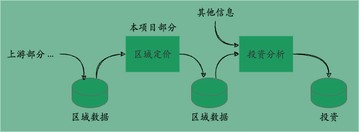
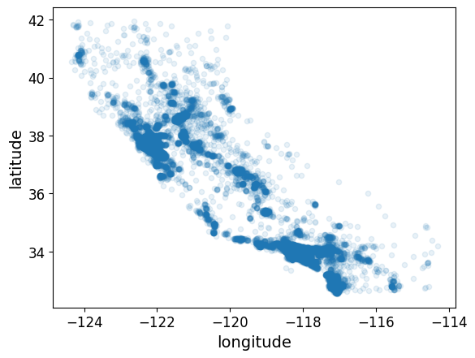
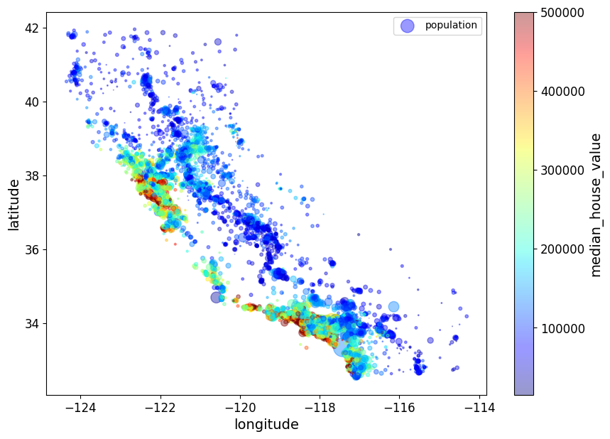
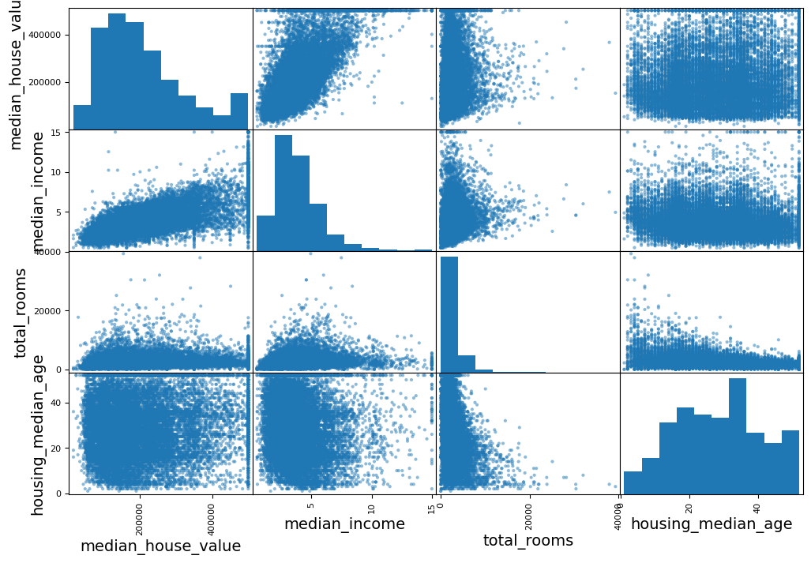
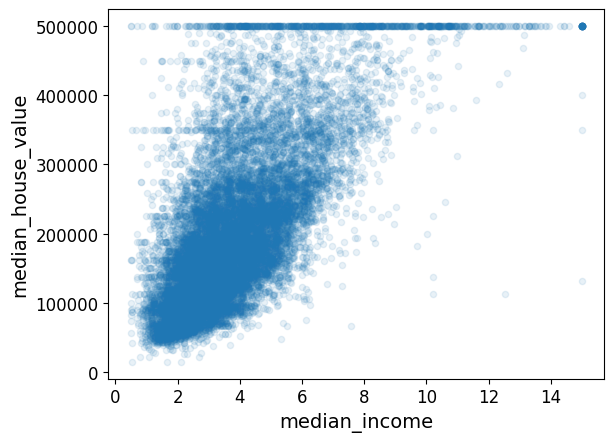

## 1. 项目分析

- `目的`：使用加州人口普查的数据建立加州的房价模型，从而根据所有其他指标，预测任意区域的房价中位数；

**机器学习项目清单**

- 框出问题并看整体；
- 获取数据；
- 研究数据以获得深刻见解；
- 准备数据以便将潜在的数据模式提供给机器学习算法；
- 探索不同模型，并列出最佳模型；
- 微调模型，并将它们组合成一个很好的解决方案；
- 演示解决方案；
- 启动、监视、维护这个系统；

### 1. 框架问题

- `业务目标`：模型的输出（对一个区域房价的中位数的预测）将会与其他信号一起传输给另一个机器学习系统；下游系统将用来决策这个区域是否值得投资；

<p class="caption">房地产投资项目流水线</p>

- `流水线`，一个序列的数据处理组件；用于机器学习系统中的数据操作和数据转化；

流水线中的组件通常是异步的，每个组件拉取大量数据，进行处理，再将结果传输给另一个数据仓库，然后下一个组件拉取前面输出的数据，并给出自己的输出，以此类推；组件与组件之间独立，只通过数仓连接，系统组件保持简单，互不干扰；

需要实施适当的监控，否则坏掉的组件虽不影响其他组件的可用性，但长时间无补救措施会导致整体系统的性能下降；

- `现有解决方案`：由专家团队手动估算区域的住房价格（先持续收集最新的区域信息，计算房价中位数，若不能计算得到，则使用复杂的规则来估算）；现行方案可供参考；

- `专家系统`，由人把知识总结出来，再教给计算机；实施过程昂贵，计算结果也未必令人满意；

这是一个典型的`监督学习`任务（已经给出了标记的训练示例），也是一个典型的`多重回归`任务、`一元回归`任务（系统要通过多个特征对某个值进行预测）；这是一个`批量学习`系统（没有连续的数据流输入，也不需要针对变化的数据做特别调整，数据量也不很大）；

### 2. 性能指标

- `均方根误差`（`RMSE`），`欧几里得范数`；可用于体现系统通常会在预测中产生多大误差；

$$
    RMSE(X, h) = \sqrt{ \frac{1}{m} \sum_{i=1}^m (h(x^i) - y^i)^2 }
$$

- `m`，表示测量 RMSE 的数据集中的实例个数（如在 2000 个区域的验证集上评估 RMSE，则 m=2000）；
- $x^i$，表示数据集中第 i 个实例的所有特征值（不包括标签）的向量；
- $y^i$，表示标签（实例的期望输出值）；

如数据集中第 1 个区域位于经度 -118.29&deg;，纬度 33.91&deg;，居民 1416 人，收入中位数 38372 美元，房屋价值中位数为 156400 美元，则

$$
    x^1 =
        \begin{pmatrix}
        -118.29 \\
        33.91 \\
        1416 \\
        38372
        \end{pmatrix}
$$

$$
    y^1 = 156400
$$

- `X`，矩阵，包含数据集中所有实例的所有特征值（不包含标签），其中每一行代表一个实例，第 i 行等于 $x^i$ 的装置，即 $(x^i)^T$；

$$
    X = \begin{pmatrix}
        (x^1)^T \\
        (x^2)^T \\
        ... \\
        (x^1999)^T \\
        (x^2000)^T
    \end{pmatrix}
    = \begin{pmatrix}
        -118.29 & 33.91 & 1416 & 38372 \\
        ... & ... & ... & ...
    \end{pmatrix}
$$

- `h`，系统的预测函数，也称假设；当给系统输入一个实例的特征向量 $x^i$ 时， 它会为该实例输出一个预测值 $\hat{y}^i = h(x^i)$（如系统预测第一个区域的房价中位数为 158400 美元，则 $\hat{y}^1 = h(x^1)$ = 158400，其预测误差为 $\hat{y}^1 - y^1$ = 2000）；
- `RMSE(X, h)`，使用假设 h 在一组实例中测量的成本函数；

**其他函数**

- `平均绝对误差`（`Mean Absolute Error`，`MAE`，`平均绝对偏差`），`曼哈顿范数`；

$$
    MAE(X, h) = \frac{1}{m} \sum_{i=1}^m | h(x^i) - y^i |
$$

RMSE 和 MAE 都是测量两个向量（预测值向量和目标值向量）之间距离的方法；范数指标越高，越关注大值而忽略小值（RMSE 对异常值比 MAE 更敏感，当`离群值`呈指数形式稀有时，RMSE 表现非常好）；

## 2. 获取数据

### 1. 准备工作区

- 创建工作区目录

```sh
export ML_HOME="$HOME/Documents/workspace/projects/aurelius/lmsl/studying/ml/handson-ml2/workspace"
mkdir -p $ML_HOME
```

- 安装 Python（这里省略安装细节）

Python 版本需要保持 python3 的较新版本，pip 版本则保持最新；

```shell
# 查看 pip 版本号
python3 -m pip --version

# 升级 pip 至最新版
python3 -m pip install --user -U pip
```

- 创建专属 Python 环境

```sh
cd $ML_HOME
# 创建一个名为 `.venv` 的专属 Python 环境
python3 -m venv .venv

# 进入专属 Python 环境
source .venv/bin/activate     # on Linux or macOS
# $ .\.venv\Scripts\activate  # on Windows

# 退出专属 Python 环境
deactivate
```

- 安装依赖模块

  - requests
  - Jupyter
  - NumPy
  - pandas
  - Matplotlib
  - ScikitLearn

```sh
# 通过 pip 按照依赖模块
pip install requests jupyter matplotlib numpy pandas scipy scikit-learn

# 将专属环境注册到 Jupyter 并给它一个名字
python -m ipykernel install --user --name=ml-venv
```

```sh
# 若安装缓慢，可切换 pip 清华镜像源
cd ~/.pip
vi pip.conf
```

```conf
# 在 ~/.pip/pip.conf 加入如下配置
[global]
index-url = https://pypi.tuna.tsinghua.edu.cn/simple

[install]
trusted-host=pypi.tuna.tsinghua.edu.cn
```

- 启用 Jupyter Notebook

```sh
jupyter notebook
```

启用 Jupyter Notebook 将在本地开启一个 Web Service，通过 http://localhost:8888 访问该服务；

推荐直接使用 VS Code 的 Jupter 插件使用 Jupyter Notebook，无须自己通过 jupyter notebook 命令启动 Jupyter Service（具体使用方法可自行探索）；

### 2. 下载数据

这个项目的数据是 csv 格式的压缩包；可以通过浏览器下载并通过 tar 命令解压获得，但推荐创建一个 Python 函数来实现通用处理；

```python
import tarfile
import requests

def fetch_data(url, path, tgz):
    if not os.path.isdir(path):
        os.makedirs(path)

    tgz_path = os.path.join(path, tgz)
    with open(tgz_path, 'wb') as w:
        w.write(requests.get(url).content)

    housing_tgz = tarfile.open(tgz_path)
    housing_tgz.extractall(path=path)
    housing_tgz.close()
```

- 将数据下载并加压到工作区路径

```python
import os

DOWNLOAD_ROOT = "https://raw.githubusercontent.com/ageron/handson-ml2/master/"
HOUSING_PATH = os.path.join("workspace", "datasets", "housing")
HOUSING_URL = DOWNLOAD_ROOT + "datasets/housing/housing.tgz"
HOUSING_TGZ = "housing.tgz"

fetch_data(HOUSING_URL, HOUSING_PATH, HOUSING_TGZ)
```

- 使用 pandas 加载并查看数据

```python
import pandas as pd

def load_data(path, csv):
    csv_path = os.path.join(path, csv)
    return pd.read_csv(csv_path)

housing = load_data(HOUSING_PATH, 'housing.csv')
```

### 3. 查看数据

**查看数据集前 5 行**

```python
housing.head()
```

<p class="caption">housing 数据集中的前 5 行</p>

- `实例属性`：
  - longitude: 经度
  - latitude: 纬度
  - housing_median_age: 住房中位数年龄
  - total_rooms: 房子总数
  - total_bedrooms: 卧室总数
  - population: 人口
  - households: 家庭（户数）
  - median_income: 收入中位数
  - median_house_value: 房价中位数
  - ocean_proximity: 海洋的距离

**查看数据集简要描述**

```python
housing info()

<class 'pandas.core.frame.DataFrame'>
RangeIndex: 20640 entries, 0 to 20639
Data columns (total 10 columns):
 #   Column              Non-Null Count  Dtype
---  ------              --------------  -----
 0   longitude           20640 non-null  float64
 1   latitude            20640 non-null  float64
 2   housing_median_age  20640 non-null  float64
 3   total_rooms         20640 non-null  float64
 4   total_bedrooms      20433 non-null  float64
 5   population          20640 non-null  float64
 6   households          20640 non-null  float64
 7   median_income       20640 non-null  float64
 8   median_house_value  20640 non-null  float64
 9   ocean_proximity     20640 non-null  object
dtypes: float64(9), object(1)
memory usage: 1.6+ MB
```

- `数据集摘要`：包含 20640 个实例，`total_bedrooms` 只有 20433 个非空值；`ocean_proximity` 是 object 类型，其他所有属性都是`数值类型`；

**查看字段分类属性**

```python
housing['ocean_proximity'].value_counts()

<1H OCEAN     9136
INLAND        6551
NEAR OCEAN    2658
NEAR BAY      2290
ISLAND           5
Name: ocean_proximity, dtype: int64
```

`ocean_proximity` 有五个类型的值，分布如上输出；

**查看数值属性的摘要**

```python
housing.describe()
```

<p class="caption">housing 数据集数值属性的摘要信息</p>

- `std`，标准差（用于测量数值的离散程度）；
- `25%`/`50%`/`75%`，百分位数，表示在观测值组中给定百分比的观测值都低于该值；
- `count`，总行数，空值会被忽略，如 total_bedrooms 的 count 是 20433；

**绘制每个属性的直方图**

```python
# 指定 Matplotlib 使用哪个后端，在 VS Code 中则无需指定
# %matplotlib inline   # only in a Jupyter notebook，令 Matplotlib 使用 Jupyter 的后端，图形在 Notebook 上显示；
import matplotlib.pyplot as plt

# hist() 依赖于 matplotlib
housing.hist(bins=50, figsize=(20,15))
plt.show()
```

<p class="caption">housing 属性直方图</p>

- `median_income`，收入中位数，明显不是美元（而是万美元）在衡量，而是按一定比例缩小了（上限 15，下限 0.5），其他属性值也有被不同程度的缩放；
- `housing_median_age` 和 `median_house_value` 也被设置了上限，而 `median_house_value` 作为预测目标属性，需要特别注意；
  - 对标签值被设置了上限的区域重新收集标签值；
  - 移除标签值超出上限的区域；
- 直方图大多显示出重尾（长尾效应），这可能导致一些机器学习算法难以检测模式，需要通过一些转化方法将这些属性转化为更偏向钟形的分布；

### 4. 创建测试集

- `数据窥探偏误`（`data snooping bias`），若提前浏览过测试集数据，可能会跌入某个看似有趣的测试数据模式，进而选择某个特殊的机器学习模型；然后当再使用测试集对泛化误差进行评估时，结果会过于乐观，在系统正式投入生产时表现不如预期；

随机选择一些实例（通常是 20%，数据集很大时可以缩小比例），将之放在一边即可；

```python
import numpy as np

def split_train_test(data, test_ratio):
    shuffled_indices = np.random.permutation(len(data))
    test_set_size = int(len(data) * test_ratio)
    test_indices = shuffled_indices[:test_set_size]
    train_indices = shuffled_indices[test_set_size:]
    return data.iloc[train_indices], data.iloc[test_indices]

train_set, test_set = split_train_test(housing, 0.2)
print(len(train_set), len(test_set))
# 16512 4128
```

这样分割的测试集重复运行会得到不同的结果，这将导致学习算法看到完整的数据集，这是创建测试集时需要避免的；

可以通过转存测试集，或固定随机数生成器种子（例如使用 np.random.seed(42)）使索引到的测试集始终相同；

这样固定测试集无法分割更新的数据集，更好的办法是使用固定算法（哈希算法），将每个实例的唯一标识（例如哈希值）作为输入，来决定是否进入测试集；

```python
from zlib import crc32

# 是否进入测试集的固定算法
def test_set_check(identifier, test_ratio):
    return crc32(np.int64(identifier)) & 0xffffffff < test_ratio * 2**32

def split_train_test_by_id(data, test_ratio, id_column):
    ids = data[id_column]
    in_test_set = ids.apply(lambda id_: test_set_check(id_, test_ratio))
    return data.loc[~in_test_set], data.loc[in_test_set]
```

- 将 index 作为唯一标识输入

```python
housing_with_id = housing.reset_index()   # adds an `index` column
train_set, test_set = split_train_test_by_id(housing_with_id, 0.2, "index")
```

需要确保新增数据只追加在数据集末尾，且不会删除任何行；

- 将经纬度作为唯一标识输入

```python
housing_with_id["id"] = housing["longitude"] * 1000 + housing["latitude"]
train_set, test_set = split_train_test_by_id(housing_with_id, 0.2, "id")
```

**使用 `Scikit-Learn`**

- train_test_split()

```python
from sklearn.model_selection import train_test_split
train_set, test_set = train_test_split(housing, test_size=0.2, random_state=42)
```

random_state 可用于设置随机数生成器，也可以把行数相同的多个数据集一次性发送给它，从而更具相同的索引将其拆分；

- `随机抽样`，适用于数据集足够庞大（相较于属性数量），否则容易导致明显的`抽样偏差`；

- `分层抽样`，将数据集按属性划分为多个子集（层），然后从每个子集抽取相同比例的实例，合并为测试集；

**保留重要属性在测试集的原始分布**

预测房价中位数，收入中位数是重要的属性，测试集应能够代表整个数据集中各种不同类型的收入；

```python
# 将收入按 0 ~ 1.5 ~ 3 ~ 4.5 ~ 6 ~ 无穷大，分为 5 个子集（层）；
housing["income_cat"] = pd.cut(housing["median_income"],
                               bins=[0., 1.5, 3.0, 4.5, 6., np.inf],
                               labels=[1, 2, 3, 4, 5])

housing["income_cat"].hist()
```

<p class="caption">收入分层</p>

通过 Scikin-Learn 的 `StratifiedShuffleSplit` 按收入分层抽样；

```python
from sklearn.model_selection import StratifiedShuffleSplit
split = StratifiedShuffleSplit(n_splits=1, test_size=0.2, random_state=42)
for train_index, test_index in split.split(housing, housing["income_cat"]):
    strat_train_set = housing.loc[train_index]
    strat_test_set = housing.loc[test_index]

# 验证分层的实例占比
strat_test_set["income_cat"].value_counts() / len(strat_test_set)

3    0.350533
2    0.318798
4    0.176357
5    0.114341
1    0.039971
Name: income_cat, dtype: float64
```

完整数据集、分层抽样测试集、随机抽样测试集中收入属性比例分布；

```python
def income_cat_proportions(data):
    return data["income_cat"].value_counts() / len(data)

train_set, test_set = train_test_split(housing, test_size=0.2, random_state=42)

compare_props = pd.DataFrame({
    "Overall": income_cat_proportions(housing),
    "Stratified": income_cat_proportions(strat_test_set),
    "Random": income_cat_proportions(test_set),
}).sort_index()
compare_props["Rand. %error"] = 100 * compare_props["Random"] / compare_props["Overall"] - 100
compare_props["Strat. %error"] = 100 * compare_props["Stratified"] / compare_props["Overall"] - 100

compare_props
```

<p class="caption">收入分层（完整、分层抽样、随机抽样）</p>

移除 income_cat 属性；

```python
for set_ in (strat_train_set, strat_test_set):
    set_.drop("income_cat", axis=1, inplace=True)
```

## 3. 数据探索

创建一个训练集的副本，以便之后的尝试不会损害训练集；

```python
housing = strat_train_set.copy()
```

### 1. 地理位置可视化

**按数据密度绘制经纬度分布图**

```python
housing.plot(kind="scatter", x="longitude", y="latitude", alpha=0.1)
```

<p class="caption">经纬度数据密度分布</p>

可以从图中清晰分辨高密度区域；

**按人口密度和房价中位数绘制经纬度分布图**

```python
housing.plot(kind="scatter", x="longitude", y="latitude", alpha=0.4,
    s=housing["population"]/100, label="population", figsize=(10,7),
    c="median_house_value", cmap=plt.get_cmap("jet"), colorbar=True,
)
plt.legend()
```

<p class="caption">经纬度人口密度和房价中位数分布</p>

人口数量用圆的半径（选项 s）表示，房价中位数用演示（选项 c）表示，其中颜色范围（选项 cmap）取自预定义颜色表 jet；

可以从图中印证房价与地理位置、人口密度息息相关；

### 2. 寻找相关性

**使用 corr() 计算每对属性之间的标准相关系数（皮尔逊）**

```python
corr_matrix = housing.corr()
corr_matrix["median_house_value"].sort_values(ascending=False)

median_house_value    1.000000
median_income         0.687151
total_rooms           0.135140
housing_median_age    0.114146
households            0.064590
total_bedrooms        0.047781
population           -0.026882
longitude            -0.047466
latitude             -0.142673
Name: median_house_value, dtype: float64
```

- `相关系数`，线性相关性，范围从 -1 到 1；越接近 1 表示越正相关；越接近 -1 表示越负相关；0 说明二者之间无线性相关性；

**使用 pandas 的 scatter_matrix() 绘制相关性**

```python
from pandas.plotting import scatter_matrix

attributes = ["median_house_value", "median_income", "total_rooms", "housing_median_age"]
scatter_matrix(housing[attributes], figsize=(12, 8))
```

<p class="caption">属性相关性图像</p>

主对角线显示的是每个属性的直方图；其他位置显示属性之间的相关性；

- 查看最有潜力预测房价中位数的属性：收入中位数（相关性最强属性）；

```python
housing.plot(kind="scatter", x="median_income", y="median_house_value", alpha=0.1)
```

<p class="caption">收入中位数与房价中位数相关性</p>

从图中可印证二者相关性较强，且 50W、35W、45W 处存在清晰的水平线，这些可能是客观存在的价格上限导致的，为了避免学习算法学到这些怪异的数据，可以尝试删除这些区域；

### 3. 组合属性

从上文属性相关性分析，可以发现一些`异常数据`（如水平线）需要提前清理掉，还有一些`重尾`分布，需要进行转换处理（如计算`对数`）等；而尝试组合属性可能让我们发现新的高相关性属性；

- 尝试组合属性，并观察与目标属性相关性

```python
housing["rooms_per_household"] = housing["total_rooms"]/housing["households"]
housing["bedrooms_per_room"] = housing["total_bedrooms"]/housing["total_rooms"]
housing["population_per_household"]=housing["population"]/housing["households"]

corr_matrix = housing.corr()
corr_matrix["median_house_value"].sort_values(ascending=False)

median_house_value          1.000000
median_income               0.687151
rooms_per_household         0.146255
total_rooms                 0.135140
housing_median_age          0.114146
households                  0.064590
total_bedrooms              0.047781
population_per_household   -0.021991
population                 -0.026882
longitude                  -0.047466
latitude                   -0.142673
bedrooms_per_room          -0.259952
Name: median_house_value, dtype: float64
```

新属性 bedrooms_per_room 与房间中位数的相关性明显高于原始属性（total_bedrooms，total_rooms）；

## 4. 数据准备

创新新的训练集副本，将其预测期与标签分开；

```python
housing = strat_train_set.drop("median_house_value", axis=1)
housing_labels = strat_train_set["median_house_value"].copy()
```

drop 不会影响 strat_train_set，只会创建一个新的数据副本；

### 1. 数据清理

**解决 total_bedrooms 的部分值缺失问题**

- `dropna()`，放弃这些缺值区域；
- `drop()`，放弃整个属性；
- `fillna()`，将缺失的值设置为某个值（0、平均数、中位数等）；

```python
housing.dropna(subset=["total_bedrooms"])    # option 1
housing.drop("total_bedrooms", axis=1)       # option 2
median = housing["total_bedrooms"].median()  # option 3
housing["total_bedrooms"].fillna(median, inplace=True)
```

**使用 Scikit-Learn 的 SimpleImputer 处理缺失值**

```python
from sklearn.impute import SimpleImputer
# 创建中位数填充处理器
imputer = SimpleImputer(strategy="median")
# 因为中位数值只能计算数值属性，这里需要移除 ocean_proximity 属性
housing_num = housing.drop("ocean_proximity", axis=1)
# 使用 fit() 将 imputer 实例适配到训练数据（计算每个属性的中位数值，并存储在 statistics_）
imputer.fit(housing_num)
# 查看中位数值
imputer.statistics_
# 比较中位数值是否计算正确
housing_num.median().values

# 使用 transform() 将中位数值替换到缺失值
X = imputer.transform(housing_num)

# 重新将 numpy 数组加载到 pandas 的 DataFrame
housing_tr = pd.DataFrame(X, columns=housing_num.columns, index=housing_num.index)
```

### 2. Scikit-Learn 的设计

- `一致性`，Scikit-Learn 的 API 设计遵守`一致性`原则，所有对象共享一个简单一致的界面；

**估算器**

根据数据集对某些参数进行估算（例如 imputer 估算中位数），由 fit() 方法执行估算，只需要一个数据集作为参数（或者一对参数，一个作为训练器，一个作为标签集），引导估算过程的其他参数即为`超参数`（如 strategy='median' 的 strategy），超参数必须是一个实例变量；

**转换器**

可以转换数据集的估算起（如 imputer）也被称为转换器，由 transform() 方法和作为参数的待转换数据集一起执行转换，返回的结果即转换后的数据集；转换过程通常依赖于学习的参数（如 imputer.statistics）；

fit_transform() 方法相当于先执行 fit() 在执行 transform()，有时可能包含一些优化，会运行得更快；

**预测器**

能够基于一个给定数据集进行预测的估算器，也被称为预测器（如 LinearRegression 模型），由 predict() 方法对一个新实例的数据集进行预测，返回一个包含相应预测结果的数据集；

score() 方法可以用来衡量给定测试集的预测质量（以及监督学习算法中对应的标签）；

- `检查`

所有估算器的`超参数`都可以通过公共实例变量（如 imputer.strategy）直接访问；
所有估算器的`学习参数`都可以通过带下划线后缀的公共变量（如 imputer.statistics\_）直接访问；

- `防止类扩散`

数据集被表示为 NumPy 数组或 SciPy 稀疏矩阵，而非自定义的类型；
超参数只是普通 Python 字符串或数值；

- `构成`

构件块尽最大可能的重用（任意序列的转换器最后加一个预测器就可以构建一个 Pipeline 估算器）；

- `合理的默认值`

Scikit-Learn 为大多数参数提供了合理的默认值，从而快速搭建一个基本的工作系统；

### 3. 处理文本、分类属性

**查看文本属性的前 10 行**

```python
housing_cat = housing[["ocean_proximity"]]
housing_cat.head(10)

	ocean_proximity
12655	INLAND
15502	NEAR OCEAN
2908	INLAND
14053	NEAR OCEAN
20496	<1H OCEAN
1481	NEAR BAY
18125	<1H OCEAN
5830	<1H OCEAN
17989	<1H OCEAN
4861	<1H OCEAN
```

ocean_proximity 不是任意文本，而是枚举值，即分类属性；

**使用 Scikit-Learn 的 OrdinalEncoder 将文本属性转数值属性**

```python
from sklearn.preprocessing import OrdinalEncoder

ordinal_encoder = OrdinalEncoder()
housing_cat_encoded = ordinal_encoder.fit_transform(housing_cat)

housing_cat_encoded[:10]

array([[1.],
       [4.],
       [1.],
       [4.],
       [0.],
       [3.],
       [0.],
       [0.],
       [0.],
       [0.]])
```

**查看类别列表**

```python
ordinal_encoder.categories_

[array(['<1H OCEAN', 'INLAND', 'ISLAND', 'NEAR BAY', 'NEAR OCEAN'],
       dtype=object)]
```

- `独热编码`，为类别属性的每个属性值创建一个二进制的属性（1 表示热，0 表示冷），避免文本属性转数值属性后，误把数值越接近的属性看作越相近；

**使用 Scikin-Learn 的 OneHotEncoder 编码器将文本属性转换为独热向量**

```python
from sklearn.preprocessing import OneHotEncoder

cat_encoder = OneHotEncoder()
housing_cat_1hot = cat_encoder.fit_transform(housing_cat)
housing_cat_1hot
# 输出一个 SciPy 稀疏矩阵；
<16512x5 sparse matrix of type '<class 'numpy.float64'>'
	with 16512 stored elements in Compressed Sparse Row format>
```

- `稀疏矩阵`，仅存储非零元素的位置，依旧可以像使用普通二维数组使用它；

**查看稀疏矩阵的二维数组表示**

```python
housing_cat_1hot.toarray()

array([[0., 1., 0., 0., 0.],
       [0., 0., 0., 0., 1.],
       [0., 1., 0., 0., 0.],
       ...,
       [1., 0., 0., 0., 0.],
       [1., 0., 0., 0., 0.],
       [0., 1., 0., 0., 0.]])
```

**查看编码器的类别列表**

```python
cat_encoder.categories_

[array(['<1H OCEAN', 'INLAND', 'ISLAND', 'NEAR BAY', 'NEAR OCEAN'],
       dtype=object)]
```

若类别属性的属性值类别很多，独热编码会产生大量输入特征，这可能会减慢训练并降低性能，此时可能需要使用相关的数字特征代替类别输入（如使用海洋距离代替 ocean_proximity，也可以用可学习的低维向量替换每一个类别）；

### 4. 自定义转换器

可以通过 Scikit-Learn 自定义转换器实现一些清理操作或组合特定属性等，可与 Scikit-Learn 自身功能无缝衔接；

Scikit-Learn 依赖鸭子类型的编译，而非继承，只要创建的类包含 fit()（返回 self）、transform()、fit_transform()；

- `TransformerMixin`，自动实现 fit_transform() 方法；
- `BaseEstimator`，获得自动调整超参数的方法 get_params() 和 set_params()；

**通过自定义转换器实现组合属性的转换器**

```python
from sklearn.base import BaseEstimator, TransformerMixin

rooms_ix, bedrooms_ix, population_ix, households_ix = 3, 4, 5, 6

class CombinedAttributesAdder(BaseEstimator, TransformerMixin):
    def __init__(self, add_bedrooms_per_room = True): # no *args or **kargs
        self.add_bedrooms_per_room = add_bedrooms_per_room

    def fit(self, X, y=None):
        return self  # nothing else to do

    def transform(self, X):
        rooms_per_household = X[:, rooms_ix] / X[:, households_ix]
        population_per_household = X[:, population_ix] / X[:, households_ix]
        if self.add_bedrooms_per_room:
            bedrooms_per_room = X[:, bedrooms_ix] / X[:, rooms_ix]
            return np.c_[X, rooms_per_household, population_per_household,
                        bedrooms_per_room]
        else:
            return np.c_[X, rooms_per_household, population_per_household]

attr_adder = CombinedAttributesAdder(add_bedrooms_per_room=False)
housing_extra_attribs = attr_adder.transform(housing.values)
```

超参数 add_bedrooms_per_room 可以用于控制是否添加 bedrooms_per_room 属性，这中实现可以提供更多的组合方式；

### 5. 特征缩放

最重要也是最需要应用到数据上的转换就是特征缩放；

同比例缩放所有属性的两种常用方法是`最小-最大缩放`和`标准化`；

- `最小-最大缩放`，`归一法`，将值缩放使其范围归于 `0 ~ 1` 之间（将所有值减去最小值并除以最大最小值之差）；Scikit-Learn 的 MinMaxScaler 转换器可以轻松实现，且其超参数 feature_range 可以调整其范围；

- `标准化`，将所有值减去平均值（标准化值的均值总是 0），再除以方差（结果的分布具备单位方差）；标准化不将值绑定在特定范围，受异常值的影响会更小；Scikit-Learn 的 StandardScaler 转化器可以实现标准化；

### 6. 流水线

- `流水线`，`Pipeline`，以一定的步骤实现多个数据转换，Scikit-Learn 的 Pipeline 提供这类转换支持；

```python
from sklearn.pipeline import Pipeline
from sklearn.preprocessing import StandardScaler

num_pipeline = Pipeline([
        ('imputer', SimpleImputer(strategy="median")),
        ('attribs_adder', CombinedAttributesAdder()),
        ('std_scaler', StandardScaler()),
    ])

housing_num_tr = num_pipeline.fit_transform(housing_num)
```

Pipeline 构造函数通过一系列名称、估算器的配对定义的序列；除了最后一个是估算器外，前面的都必须是转换器（实现了 fit_transform() 方法）；

当调用 Pipeline 的 fit() 方法时，会按顺序依次调用转换器的 fit_transform() 方法，并将上个转换器的输出作为参数传递给下个转换器，直到传递给最后的估算器，并执行最后估算器的 fit() 方法；

**使用 Scikit-Learn 的 ColumnTransformer 转换器处理所有列**

```python
from sklearn.compose import ColumnTransformer
num_attribs = list(housing_num)
cat_attribs = ["ocean_proximity"]

full_pipeline = ColumnTransformer([
        ("num", num_pipeline, num_attribs),
        ("cat", OneHotEncoder(), cat_attribs),
    ])
housing_prepared = full_pipeline.fit_transform(housing)
```

ColumnTransformer 可以通过传递列名称列表，将转换作用在数据集的指定列上，并沿第二个轴合并输出（转换器的返回行数必须相同）；

稀疏矩阵与密集矩阵合并，ColumnTransformer 会估算最终矩阵的密度（单元格的非零比率），若密度低于给定阈值（sparse_threshold 默认为 0.3），则返回一个稀疏矩阵；

## 5. 选择和训练模型

### 1. 训练和评估训练集

**训练一个线性回归模型**

```python
from sklearn.linear_model import LinearRegression

lin_reg = LinearRegression()
lin_reg.fit(housing_prepared, housing_labels)
```

**使用训练集的实例测试预测结果**

```python
some_data = housing.iloc[:5]
some_labels = housing_labels.iloc[:5]
some_data_prepared = full_pipeline.transform(some_data)
print("Predictions:", lin_reg.predict(some_data_prepared))
print("Labels:", list(some_labels))

Predictions: [ 86208. 304704. 153536. 185728. 244416.]
Labels: [72100.0, 279600.0, 82700.0, 112500.0, 238300.0]
```

**测量训练集上回归模型的 RMSE**

使用 Scikit-Learn 的 mean_squared_error() 进行均方根误差测量；

```python
from sklearn.metrics import mean_squared_error
housing_predictions = lin_reg.predict(housing_prepared)
lin_mse = mean_squared_error(housing_labels, housing_predictions)
lin_rmse = np.sqrt(lin_mse)
print(lin_rmse)

68633.40810776998
```

说明预测误差达到 68628 美元，而整个 median_housing_values 也只是分布在 120000 ~ 26500 美元之间，这么大的误差说明这是一个模型对训练数据欠拟合的方案；

这时我们可尝试的优化方式有：选择更强大的模型、为算法训练提供更好的特征、减少对模型的限制；

**使用 DecisionTreeRegressor 训练一个决策树**

从数据中找到复杂的非线性关系；

```python
from sklearn.tree import DecisionTreeRegressor
tree_reg = DecisionTreeRegressor()
tree_reg.fit(housing_prepared, housing_labels)
```

**测量训练集上回归模型的 RMSE**

```python
housing_predictions = tree_reg.predict(housing_prepared)
tree_mse = mean_squared_error(housing_labels, housing_predictions)
tree_rmse = np.sqrt(tree_mse)
print(tree_rmse)

0.0
```

0 误差说明模型要么绝对完美（这不可能），要么对数据严重过拟合；

### 2. 交叉验证

通过交叉验证对决策树模型进行评估；

**使用 Scikit-Learn 的 cross_val_score 进行 K 折交叉验证**

```python
from sklearn.model_selection import cross_val_score

scores = cross_val_score(tree_reg, housing_prepared, housing_labels, scoring="neg_mean_squared_error", cv=10)
tree_rmse_scores = np.sqrt(-scores)
```

scores 为 MSE 的负数（代表效用函数，越大越好），`np.sqrt(-scores)` 正好计算 RMSE；

```python
def display_scores(scores):
    print("Scores:", scores)
    print("Mean:", scores.mean())
    print("Standard deviation:", scores.std())

display_scores(tree_rmse_scores)

Scores: [73444.02930862 69237.91537492 67003.65412022 71810.57760783
 70631.08058123 77465.52053272 70962.67507776 73613.93631416
 68442.91744801 72364.26672416]
Mean: 71497.65730896383
Standard deviation: 2835.532019536459
```

该决策树在验证集的平均 RMSE 评分为 71497（训练集：0），上下浮动（精确度）为 2835；

**线性回归模型的交叉验证**

```python
lin_scores = cross_val_score(lin_reg, housing_prepared, housing_labels,
                             scoring="neg_mean_squared_error", cv=10)
lin_rmse_scores = np.sqrt(-lin_scores)
display_scores(lin_rmse_scores)

Scores: [71800.38078269 64114.99166359 67844.95431254 68635.19072082
 66801.98038821 72531.04505346 73992.85834976 68824.54092094
 66474.60750419 70143.79750458]
Mean: 69116.4347200802
Standard deviation: 2880.6588594759014
```

线性回归模型在验证集的平均 RMSE 评分为 69116（训练集：68633），上下浮动（精确度）为 2880；

决策树的 RMSE 评分比线性回归模型还高，可见是严重过拟合的；

**使用 RandomForestRegressor 训练随机森林**

- `随机森林`：通过对特征的随机子集进行许多个决策树的训练，然后对其预测取平均；在多个模型的基础之上建立模型，称为集成学习；

```python
from sklearn.ensemble import RandomForestRegressor

forest_reg = RandomForestRegressor()
forest_reg.fit(housing_prepared, housing_labels)
housing_predictions = forest_reg.predict(housing_prepared)
forest_mse = mean_squared_error(housing_labels, housing_predictions)
forest_rmse = np.sqrt(forest_mse)
print(forest_rmse)

forest_scores = cross_val_score(forest_reg, housing_prepared, housing_labels,
                scoring="neg_mean_squared_error", cv=10)
forest_rmse_scores = np.sqrt(-forest_scores)
display_scores(forest_rmse_scores)

18580.285001969234
Scores: [51420.10657898 48950.26905778 46724.70163181 52032.16751813
 47382.48485738 51644.10218989 52532.85241798 50040.96772226
 48869.83863791 53727.35461654]
Mean: 50332.484522865096
Standard deviation: 2191.1726721020977
```

训练集 RMSE 评分为 18580，验证集评分为 50332，上下浮动（精确度）为 2191，虽然比上两个模型表现好很多，但训练集评分远低于验证集，可见依旧是过拟合的；

在进行模型简化、模型约束之前，可以去尝试更多的机器学习算法（如不同内核的支持向量机、神经网络模型等），先筛选几个有效的模型，别花太多时间在调整超参数；

**保存模型**

```python
import joblib

joblib.dump(forest_reg, "./workspace/models/forest_reg.pkl")
# and later, reload model...
forest_reg_loaded = joblib.load("./workspace/models/forest_reg.pkl")
```

## 6. 微调模型

有了几个有效候选模型后，可以对它们进行微调；

### 1. 网格搜索

- `网格搜索`，`Scikit-Learn` 的 `GridSearchCV` 可以通过设置实验的超参数，以及需要尝试的值，使用`交叉验证`来评估超参数的所有可能组合，从而得到最佳组合；

```python
from sklearn.model_selection import GridSearchCV

param_grid = [
    {'n_estimators': [3, 10, 30], 'max_features': [2, 4, 6, 8]},
    {'bootstrap': [False], 'n_estimators': [3, 10], 'max_features': [2, 3, 4]},
    ]
forest_reg = RandomForestRegressor()
grid_search = GridSearchCV(forest_reg, param_grid, cv=5,
                            scoring='neg_mean_squared_error',
                            return_train_score=True)
grid_search.fit(housing_prepared, housing_labels)
```

- `parram_grid`，超参数网格设置；
  - `n_estimators`，`max_features`，超参数名，给定 `3 * 4 = 12` 种值；
  - `bootstrap`，`n_estimators`，`max_features`，超参数名，给定 `1 * 2 * 3 = 6` 种值；
- `cv`，对上述 18 种组合的超参数进行了 5 次训练（5-折交叉验证）；
- `refit`，=True（默认） 可以让 GridSearchCV 通过交叉验证找到最佳估算器后，再在整个训练集上重新训练模型（更多的数据可以提升模型性能）；

**查看网格搜索结果**

```python
grid_search.best_params_

{'max_features': 6, 'n_estimators': 30}
```

**获得最好的估算器**

```python
grid_search.best_estimator_
```

**估算器的评估分数**

```python
cvres = grid_search.cv_results_
for mean_score, params in zip(cvres["mean_test_score"], cvres["params"]):
    print(np.sqrt(-mean_score), params)

63475.5397459137 {'max_features': 2, 'n_estimators': 3}
55754.473565553184 {'max_features': 2, 'n_estimators': 10}
52830.64714547093 {'max_features': 2, 'n_estimators': 30}
60296.33920014068 {'max_features': 4, 'n_estimators': 3}
52504.03498357088 {'max_features': 4, 'n_estimators': 10}
50328.7606181505 {'max_features': 4, 'n_estimators': 30}
59328.255990059035 {'max_features': 6, 'n_estimators': 3}
51909.34406264884 {'max_features': 6, 'n_estimators': 10}
49802.234477838996 {'max_features': 6, 'n_estimators': 30}
58997.87515871176 {'max_features': 8, 'n_estimators': 3}
52036.752607340735 {'max_features': 8, 'n_estimators': 10}
50321.971231209965 {'max_features': 8, 'n_estimators': 30}
62389.547952235145 {'bootstrap': False, 'max_features': 2, 'n_estimators': 3}
53800.36505088281 {'bootstrap': False, 'max_features': 2, 'n_estimators': 10}
59953.45347364427 {'bootstrap': False, 'max_features': 3, 'n_estimators': 3}
52115.46931655621 {'bootstrap': False, 'max_features': 3, 'n_estimators': 10}
59061.9294179386 {'bootstrap': False, 'max_features': 4, 'n_estimators': 3}
52197.755732390906 {'bootstrap': False, 'max_features': 4, 'n_estimators': 10}
```

最佳估算器（max_features: 6, n_estimators: 30）的 RMSE 评分为 49802，略优于默认超参数的 50332，模型得到了优化；

可以通过数据准备阶段定义的超参数（用于控制异常值处理、缺失特征、特征选择等）进行网格搜索，从而自动探索问题的最佳解决办法；

### 2. 随机搜索

- `随机搜素`，`Scikit-Learn` 的 `RandomizedSearchCV` 与 `GridSearchCV` 大致相同，但每次迭代中只会为每个超参数选择一个随机值，然后对一定数量的随机组合进行评估；
  - 可以通过反复执行随机搜索，从而每次探索不一样的超参数；而不像网格搜索，必须固定每个超参数的搜索范围；
  - 可以通过简单的迭代次数设置，更好的控制分配给超参数搜索的计算预算；

**使用 RandomizedSearchCV 评估支持向量机回归器**

```python
from sklearn.svm import SVR
from sklearn.model_selection import RandomizedSearchCV
from scipy.stats import expon, reciprocal

# see https://docs.scipy.org/doc/scipy/reference/stats.html
# for `expon()` and `reciprocal()` documentation and more probability distribution functions.

# Note: gamma is ignored when kernel is "linear"
param_distribs = {
        'kernel': ['linear', 'rbf'],
        'C': reciprocal(20, 200000),
        'gamma': expon(scale=1.0),
    }

svm_reg = SVR()
rnd_search = RandomizedSearchCV(svm_reg, param_distributions=param_distribs,
                                n_iter=50, cv=5, scoring='neg_mean_squared_error',
                                verbose=2, random_state=42)
rnd_search.fit(housing_prepared, housing_labels)

Fitting 5 folds for each of 50 candidates, totalling 250 fits
[CV] END C=629.782329591372, gamma=3.010121430917521, kernel=linear; total time=   3.3s
[CV] END C=629.782329591372, gamma=3.010121430917521, kernel=linear; total time=   3.3s
[CV] END C=629.782329591372, gamma=3.010121430917521, kernel=linear; total time=   3.2s
[CV] END C=629.782329591372, gamma=3.010121430917521, kernel=linear; total time=   3.2s
[CV] END C=629.782329591372, gamma=3.010121430917521, kernel=linear; total time=   3.2s
...

negative_mse = rnd_search.best_score_
rmse = np.sqrt(-negative_mse)
print(rmse)

54767.960710084146

print(rnd_search.best_params_)

{'C': 157055.10989448498, 'gamma': 0.26497040005002437, 'kernel': 'rbf'}
```

随机搜索到支持向量机回归器的一组最优超参数，最终 RMSE 评分为 54767；

### 3. 集成方法

- `集成方法`，将表现最优的模型组合起来通常比单一模型表现更好（如随机森林之于决策树），特别是当单一模型会产生不同类型的误差时；

### 4. 模型误差

**查看每个属性的相对重要层度**

```python
feature_importances = grid_search.best_estimator_.feature_importances_
print(feature_importances)

array([8.30181927e-02, 7.09849240e-02, 4.24425223e-02, 1.76691115e-02,
       1.61540923e-02, 1.71789859e-02, 1.59395934e-02, 3.39837758e-01,
       6.50843504e-02, 1.04717194e-01, 6.48945156e-02, 1.47186585e-02,
       1.38881431e-01, 6.76526692e-05, 3.02499407e-03, 5.38602332e-03])

extra_attribs = ["rooms_per_hhold", "pop_per_hhold", "bedrooms_per_room"]
cat_encoder = full_pipeline.named_transformers_["cat"]
cat_one_hot_attribs = list(cat_encoder.categories_[0])
attributes = num_attribs + extra_attribs + cat_one_hot_attribs
sorted(zip(feature_importances, attributes), reverse=True)

[(0.3398377582278221, 'median_income'),
 (0.13888143088401578, 'INLAND'),
 (0.10471719429817675, 'pop_per_hhold'),
 (0.0830181926813895, 'longitude'),
 (0.07098492396156919, 'latitude'),
 (0.06508435039879204, 'rooms_per_hhold'),
 (0.06489451561779028, 'bedrooms_per_room'),
 (0.042442522257867, 'housing_median_age'),
 (0.017669111520336293, 'total_rooms'),
 (0.017178985883288055, 'population'),
 (0.016154092256827887, 'total_bedrooms'),
 (0.015939593408818325, 'households'),
 (0.0147186585483286, '<1H OCEAN'),
 (0.005386023320075893, 'NEAR OCEAN'),
 (0.0030249940656810405, 'NEAR BAY'),
 (6.765266922142473e-05, 'ISLAND')]
```

可以尝试删除一些不太有用的特征（本例中只有一个 ocean_proximity 是有用的，其他就可以删除）；

还可以通过添加额外特征、删除没有信息的特征、清除异常值等优化模型；

### 5. 通过测试集评估系统

**在测试集评估最终模型**

```python
final_model = grid_search.best_estimator_
X_test = strat_test_set.drop("median_house_value", axis=1)
y_test = strat_test_set["median_house_value"].copy()
X_test_prepared = full_pipeline.transform(X_test)
final_predictions = final_model.predict(X_test_prepared)
final_mse = mean_squared_error(y_test, final_predictions)
final_rmse = np.sqrt(final_mse)
print(final_rmse)

47785.02562107877
```

**使用 scipy.stats.t.interval() 计算泛化误差的 95% 置信区间**

```python
from scipy import stats

confidence = 0.95
squared_errors = (final_predictions - y_test) ** 2
np.sqrt(stats.t.interval(confidence, len(squared_errors) - 1,
                         loc=squared_errors.mean(),
                         scale=stats.sem(squared_errors)))

array([45805.04012754, 49686.17157851])
```

在测试集的评估结果会略逊于之前使用交叉验证时的表现，这时不要再继续调整超参数试图让测试集的结果变得好看一些，因为这些改进对于新的数据集上的泛化效果是无用的；

系统的最终性能可能并不比专家系统效果好（比如下降 20% 左右），但这并不一定是无用功，这个机器学习系统可以提供一些有用的信息，一定层度上解放专家系统的任务量；

可以通过特定测试集（如内陆的区域、靠近海洋的区域）评估模型的长短处；

## 7. 部署、监控与系统维护

### 1. 部署

**通过 REST API 开放服务**

<p class="caption">REST API 部署方式</p>

- 通过 joblib 将训练好的 Scikit-Learn 模型序列化保存，这个模型包含完整的预处理和预测流水线；
- 在生产环境通过 Web Service 加载这个模型，并开放调用模型 predict 功能的接口；
- 可以在模型服务的前面通过一个 Web App 与之交互，提供新数据输入和预测结果处理，并将结果开放给桌面端和移动端用户；

**通过 Google Cloud AI Platform 部署**

- 将 joblib 序列化的模型上传到 Google CloudStorage（GCS）;
- 在 Google Cloud AI Platform 创建新的模型版本，模型指向 GCS 上的模型文件；
- Google Cloud AI Platform 会直接提供一个简单的 Web Service（类似上文的模型服务）；

### 2. 系统监控

- `监控目标`

  - 编写监控代码定期检查系统的实时性能，在系统性能降低时触发报警；

- `监控方向`

  - 基础架构中的组件损坏可能引擎性能大降；
  - 性能的轻微下降在长时间内可能被忽略；
  - 外界是变化的，可能训练的模型在一段时间后不再适应新输入的数据；

- `评估方式`
  - 可以从下游推断模型的性能指标（如推荐系统重，推荐与不推荐产生的订单数多少，即体现了推荐系统性能的优劣）；
  - 让人工分析介入系统性能评估（如引入专家、非专家、众包平台上的工人对数据标记，Google 的验证码就有标记训练数据的功能）；
  - 监控模型的输入数据的质量（如对比输入数据与训练集的平均值、标准差等，或分类特征出现新类别等），可以提前发现引发系统性能下降的原因；

### 3. 系统维护

系统维护的最佳做法是让其整个过程自动化；

**系统维护所需做的事情**

- 定期收集新数据，并做标记（必要时人工标记）；
- 编写脚本定期训练模型，并自动微调超参数（根据需求让脚本定期跑起来）；
- 编写脚本在更新的测试集上评估新模型和旧模型，对比二者性能决定是否替换到生产环境中；
- 保留所有版本的模型，方便快速回滚；保留每个版本的数据集，方便回滚（新数据集被破坏时，如添加了离群值）和其他模型的评估；

机器学习涉及很多基础建设工作，第一个机器学习项目花费大量精力和时间来构建和部署这些组件是很正常的，一旦这些流程走通，往后的模型服务上线与迭代都将是很容易的事情；

推荐读者从 [Kaggle](https://www.kaggle.com/) 这样的竞赛网站选择一个不错的目标，然后将整个流程 Run 起来；

## 8. 可用数据源

- 流行的开放数据存储库:
  - [UC Irvine Machine Learning Repository](http://archive.ics.uci.edu/ml/)
  - [Kaggle datasets](https://www.kaggle.com/datasets)
  - [Amazon’s AWS datasets](http://aws.amazon.com/fr/datasets/)
- 元门户站点(它们会列出开放的数据存储库):
  - [Data Portals](http://dataportals.org/)
  - [OpenDataMonitor](http://opendatamonitor.eu/)
  - [Quandl](http://quandl.com/)
- 其他一些列出许多流行的开放数据存储库的页面:
  - [Wikipedia’s list of Machine Learning datasets](https://goo.gl/SJHN2k)
  - [Quora.com](http://goo.gl/zDR78y)
  - [The datasets subreddit](https://www.reddit.com/r/datasets)

---

**欢迎各路道友`阅读`与`评论`，感谢道友`点赞`、`关注`、`收藏`！**

---

**参考资料：**

- [1]《机器学习》
- [2]《机器学习实战》
