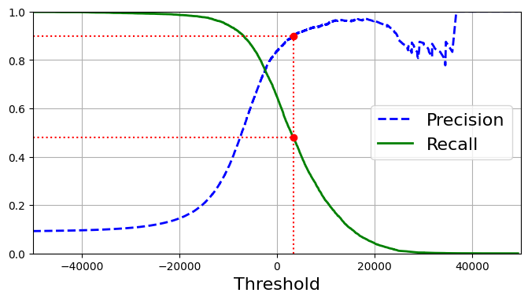
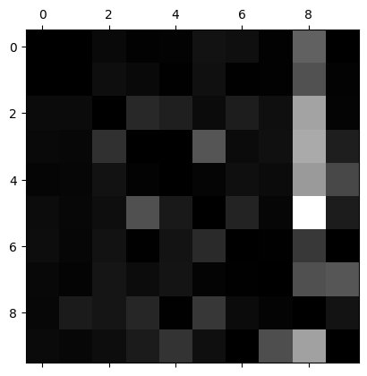
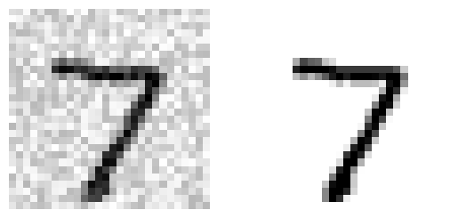

- `目的`：使用 MNIST 数据集，建立数字图像识别模型，识别任意图像中的数字；

## 1. 数据准备（MNIST）

- `MNIST`，一组由美国高中生和人口调查局员工手写的 70000 个数字图片；每张图片都用其代表的数字标记；因广泛被应用于机器学习入门，被称作机器学习领域的 `Hello World`；也可用于测试新分类算法的效果；

**使用 `Scikit-Learn` 下载数据集的前置工作**

```python
import ssl
ssl._create_default_https_context = ssl._create_unverified_context
```

`Scikit-Learn` 使用 Python 的 `urllib` 包通过 `HTTPS` 协议下载数据集，这里全局取消证书验证（否则 `Scikit-Learn` 可能无法建立 ssl 连接）；

**使用 Scikit-Learn 下载 MNIST**

```python
from sklearn.datasets import fetch_openml
mnist = fetch_openml('mnist_784', version=1)
mnist.keys()

dict_keys(['data', 'target', 'frame', 'categories', 'feature_names', 'target_names', 'DESCR', 'details', 'url'])

### 查看数组
X, y = mnist["data"], mnist["target"]
X.shape

(70000, 784)

y.shape
(70000,)
```

共 70000 张图片，每张图片由 784 个特征（28 \* 28 个像素，每个像素用 0(白色) 到 255(黑色) 表示）；

**Scikit-Learn 数据集通用字典结构**

- `DESCR`，描述数据集；
- `data`，包含一个数组，每个实例为一行，每个特征为一列；
- `target`，包含一个带有标记的数组；

**使用 Matplotlib 查看数字图片**

- 编写绘图函数；

```python
import matplotlib.pyplot as plt
import matplotlib as mpl

def plot_digit(data):
    image = data.reshape(28, 28)
    plt.imshow(image, cmap = mpl.cm.binary, interpolation="nearest")
    plt.axis("off")


def plot_digits(instances, images_per_row=10, **options):
    size = 28
    images_per_row = min(len(instances), images_per_row)
    # This is equivalent to n_rows = ceil(len(instances) / images_per_row):
    n_rows = (len(instances) - 1) // images_per_row + 1

    # Append empty images to fill the end of the grid, if needed:
    n_empty = n_rows * images_per_row - len(instances)
    padded_instances = np.concatenate([instances, np.zeros((n_empty, size * size))], axis=0)

    # Reshape the array so it's organized as a grid containing 28×28 images:
    image_grid = padded_instances.reshape((n_rows, images_per_row, size, size))

    # Combine axes 0 and 2 (vertical image grid axis, and vertical image axis),
    # and axes 1 and 3 (horizontal axes). We first need to move the axes that we
    # want to combine next to each other, using transpose(), and only then we
    # can reshape:
    big_image = image_grid.transpose(0, 2, 1, 3).reshape(n_rows * size, images_per_row * size)
    # Now that we have a big image, we just need to show it:
    plt.imshow(big_image, cmap = mpl.cm.binary, **options)
    plt.axis("off")
```

- MNIST 的第一个图片展示；

```python
some_digit = X[:1].to_numpy()
plot_digit(some_digit)
plt.show()
```

<p class="caption">MNIST 第一张样本图片</p>

```python
# 查看图片对应标签，验证是一个数字 '5'
y[0]

'5'
```

- MNIST 的多图样例展示；

```python
plt.figure(figsize=(9,9))
example_images = X[:100]
plot_digits(example_images, images_per_row=10)
# save_fig("more_digits_plot")
plt.show()
```

<p class="caption">MNIST 样本图片</p>

**将字符标签转换成整数**

```python
import numpy as np

y = y.astype(np.uint8)
```

**创建测试集**

```python
X_train, X_test, y_train, y_test = X[:60000], X[60000:], y[:60000], y[60000:]
```

MNIST 数据集已经分成训练集（前 6 万张图片）和测试集（最后 1 万张图片）；

可以对训练集进行混洗，保障在做交叉验证时所有折叠的实例分布相当；有一些算法对训练实例的顺序敏感，连续输入相同的实例可能导致性能不佳；也有一些情况时间序列也是实例特征（如股市架构或天气状态），则不可混洗数据集；

## 2. 二元分类器（SGD）

- `二元分类器`，在两个类中区分；

简化问题，图片数字识别，先从识别图片 `是 5` 和 `非 5` 开始；

**转换图片的标签**

```python
y_train_5 = (y_train == 5)  # True for all 5s, False for all other digits
y_test_5 = (y_test == 5)
```

**使用 Scikit-Learn 的 SGDClassifier 训练随机梯度下降（SGD）分类器**

- `SGD`，独立处理训练实例，一次一个，非常适合处理大型的数据集，也适合在线学习；

```python
from sklearn.linear_model import SGDClassifier

sgd_clf = SGDClassifier(random_state=42)
sgd_clf.fit(X_train, y_train_5)
```

给 `random_state` 设置固定值，如 `=42` 可以让 SGD 的随机训练变得结果可复现；

```python
sgd_clf.predict(X[:1])

array([ True])
```

SGD 分类器预测这是一张 `5`，结果正确；

## 3. 性能测试

- `准确率`，正确预测的比率；

### 1. 交叉验证

**自定义实现交叉验证**

```python
from sklearn.model_selection import StratifiedKFold
from sklearn.base import clone

skfolds = StratifiedKFold(n_splits=3, random_state=42, shuffle=True)

for train_index, test_index in skfolds.split(X_train, y_train_5):
    clone_clf = clone(sgd_clf)
    X_train_folds = X_train.iloc[train_index]
    y_train_folds = y_train_5.iloc[train_index]
    X_test_fold = X_train.iloc[test_index]
    y_test_fold = y_train_5.iloc[test_index]
    clone_clf.fit(X_train_folds, y_train_folds)
    y_pred = clone_clf.predict(X_test_fold)
    n_correct = sum(y_pred == y_test_fold)
    print(n_correct / len(y_pred))

0.9669
0.91625
0.96785
```

- `StratifiedKFold`，实现分层抽样；让每个折叠中各个类的比例与整体比例相当；
- `clone`，为每个迭代创建一个分类器的副本，用于对训练集的训练和测试集的预测；

**使用 Scikit-Learn 的 cross_val_score() 实现 K-折交叉验证**

```python
from sklearn.model_selection import cross_val_score
cross_val_score(sgd_clf, X_train, y_train_5, cv=3, scoring="accuracy")

array([0.95035, 0.96035, 0.9604 ])
```

- `K-折交叉验证`，将训练集分解成 K 个折叠（这里是 3 折），每次留 1 个折叠用于测试集，剩余用于训练集；

所有折叠交叉验证的准确率都超过了 91%，这看似很准确，实则准确率不足以衡量这个分类器的优劣；

**自定义 `非 5` 分类器**

```python
from sklearn.base import BaseEstimator

class Never5Classifier(BaseEstimator):
    def fit(self, X, y=None):
        return self
    def predict(self, X):
        return np.zeros((len(X), 1), dtype=bool)

never_5_clf = Never5Classifier()
cross_val_score(never_5_clf, X_train, y_train_5, cv=3, scoring="accuracy")

array([0.91125, 0.90855, 0.90915])
```

使用自定义 `非 5` 分类器进行交叉验证，得到所有折叠的准确率也在 90% 以上；这是因为所有图片中只有约 10% 是数字 5，90% 非 5 是正确的；这进一步说明准确率不足以评判分类器的性能（特别是处理有偏数据集时）；

### 2. 混淆矩阵

- `混淆矩阵`，对多个二分类或多分类进行训练/测试，统计 A 类实例被分类为 B 类别的次数；是评估分类器性能的常见方法；

- **使用 cross_val_predict() 进行 K-折交叉预测**

```python
from sklearn.model_selection import cross_val_predict

y_train_pred = cross_val_predict(sgd_clf, X_train, y_train_5, cv=3)
```

cross_val_predict 与 cross_val_score 类似，但返回的不是交叉验证的评分，而是每个折叠的预测值；

- **使用 confusion_matrix() 获取混淆矩阵**

```python
from sklearn.metrics import confusion_matrix

confusion_matrix(y_train_5, y_train_pred)

array([[53892,   687],
       [ 1891,  3530]])
```

混淆矩阵的行表示实际类别（实际为 `非 5`、`5`），列表示预测类别（预测为 `非 5`、`5`）；

<p class="caption">混淆矩阵示意图</p>

- `负类（Negative）`：实际为`非 5`
  - `真负类（TN）`：53892 个`正确`分类为`非 5`；
  - `假正类（FP）`：687 个`错误`分类为 `5`；
- `正类（Positive）`：实际为 `5`
  - `假负类（FN）`：1891 个`错误`分类为 `非 5`；
  - `真正类（TP）`：3530 个`正确`分类为 `5`；

完美的分类器只存在真正类与真负类，混淆矩阵的对角线（左上和右下）有非零值；

```python
y_train_perfect_predictions = y_train_5  # pretend we reached perfection
confusion_matrix(y_train_5, y_train_perfect_predictions)

array([[54579,     0],
       [    0,  5421]])
```

### 3. 查准率与查全率

- `查准率(precision)`，真正类占真正类和假正类之和的比例；将忽略这个正类实例之外的所有内容；

$$
    precision = \frac{TP}{TP + FP}
$$

- `查全率(recall)`: `召回率`，`灵敏度`或`真正类率`，真正类占所有正类（真正类和假负类）之和的比例；正确检测到的正类实例的比率；

$$
    recall = \frac{TP}{TP + FN}
$$

**使用 Scikit-Learn 计算查准率和查全率**

```python
from sklearn.metrics import precision_score, recall_score

precision_score(y_train_5, y_train_pred) # == 3530 / (3530 + 687)

0.8370879772350012

recall_score(y_train_5, y_train_pred) # == 3530 / (3530 + 1891)

0.6511713705958311
```

这说明，当这个 `5-检测器` 说一张图片是 5 时，只有 83% 时准确的，且只有 65% 的 5 被检测出来了；

- **$F_1$ 分数**，查准率与查全率的谐波平均值，会给予低值更高的权重；更适用于查准率和查全率相近的分类器；

$$
    F_1 = \frac{2}{\frac{1}{precision} + \frac{1}{recall}}
        = 2 \times \frac{precision \times recall}{precision + recall}
        = \frac{TP}{TP = \frac{FN + FP}{2}}
$$

**使用 f1_score() 计算 $F_1$ 分数**

```python
from sklearn.metrics import f1_score

f1_score(y_train_5, y_train_pred)

0.7325171197343846
```

`鱼与熊掌不可得兼`，不能同时兼顾查准率和查全率；

- 对于`宁缺毋滥`类型的分类器，更在乎查准率（如给小孩子推荐视频）；

- 对于`宁杀错不放过`类型的分类器，更在乎查全率（如小区监控抓小偷）；

### 4. P-R 曲线

- **`P-R 曲线`**，将实例按预测为正类的概率高低排序，然后逐个把样本作为正类进行预测评估，计算其查准率和查全率，以查全率为横轴，查准率为纵轴绘制一个曲线图；

**SGDClassifier 的分类决策**

<p class="caption">SGD 分类决策过程</p>

基于决策函数计算处每个实例的分值；将每个实例按分数从低到高从左到右排列；取一个阈值，大于该阈值的实例为正类，否则为负类；（通常阈值越高，查全率越低，查准率越高）；

- 若决策阈值在中间箭头位置（两个 5 之间），查准率为 80%（4/5），查全率为 67%（4/6）；
- 若决策阈值在右边箭头位置（提升阈值），查准率为 100%（3/3），查全率为 50%（3/6）；
- 若决策阈值在左边箭头位置（降低阈值），查准率为 75%（6/8），查全率为 100%（6/6）；

**使用 decision_function() 获取每个实例的分数**

```python
y_scores = sgd_clf.decision_function(some_digit)
y_scores

array([2164.22030239])
```

- 通过阈值控制预测结果；

```python
threshold = 0
y_some_digit_pred = (y_scores > threshold)
y_some_digit_pred

array([ True])
```

- 提升阈值控制预测结果；

```python
threshold = 8000
y_some_digit_pred = (y_scores > threshold)
y_some_digit_pred

array([False])
```

提升阈值可以降低查全率（将本是 5 的图片判定为了`非 5`）；

**使用 cross_val_predict() 获取训练集的实例分数**

```python
y_scores = cross_val_predict(sgd_clf, X_train, y_train_5, cv=3, method="decision_function")
```

**使用 precision_recall_curve() 计算所有阈值对应的查准率和查全率**

```python
from sklearn.metrics import precision_recall_curve

precisions, recalls, thresholds = precision_recall_curve(y_train_5, y_scores)
```

**绘制查准率和查全率与决策阈值的关系曲线**

```python
def plot_precision_recall_vs_threshold(precisions, recalls, thresholds):
    plt.plot(thresholds, precisions[:-1], "b--", label="Precision", linewidth=2)
    plt.plot(thresholds, recalls[:-1], "g-", label="Recall", linewidth=2)
    plt.legend(loc="center right", fontsize=16)
    plt.xlabel("Threshold", fontsize=16)
    plt.grid(True)
    plt.axis([-50000, 50000, 0, 1])


recall_90_precision = recalls[np.argmax(precisions >= 0.90)]
threshold_90_precision = thresholds[np.argmax(precisions >= 0.90)]


plt.figure(figsize=(8, 4))
plot_precision_recall_vs_threshold(precisions, recalls, thresholds)
plt.plot([threshold_90_precision, threshold_90_precision], [0., 0.9], "r:")
plt.plot([-50000, threshold_90_precision], [0.9, 0.9], "r:")
plt.plot([-50000, threshold_90_precision], [recall_90_precision, recall_90_precision], "r:")
plt.plot([threshold_90_precision], [0.9], "ro")
plt.plot([threshold_90_precision], [recall_90_precision], "ro")
plt.show()
```

<p class="caption">查准率和查全率与决策阈值的关系曲线</p>

查准率比查全率曲线要崎岖一些，因为随着阈值的提升，查准率可能会下降，但查全率只会下降；

**绘制 P/R 曲线**

以查全率为横轴，查准率为纵轴，将上文`决策阈值关系图`转化成一张 **`P-R 曲线`**；

```python
def plot_precision_vs_recall(precisions, recalls):
    plt.plot(recalls, precisions, "b-", linewidth=2)
    plt.xlabel("Recall", fontsize=16)
    plt.ylabel("Precision", fontsize=16)
    plt.axis([0, 1, 0, 1])
    plt.grid(True)

plt.figure(figsize=(8, 6))
plot_precision_vs_recall(precisions, recalls)
plt.plot([recall_90_precision, recall_90_precision], [0., 0.9], "r:")
plt.plot([0.0, recall_90_precision], [0.9, 0.9], "r:")
plt.plot([recall_90_precision], [0.9], "ro")
plt.show()
```

<p class="caption">PR 曲线</p>

查全率在 80% 之后，查准率急剧下降，说明可能需要在此之前选择一个`权衡点`；

通常若学习器 A 的 P-R 曲线能完全包住学习器 B 的，则可断言 A 优于 B；若存在交叉，可采用面积比较法，或平衡点比较法；

**查找指定查准率/查全率的最低/最高阈值**

```python
>>> threshold_90_precision = thresholds[np.argmax(precisions >= 0.90)]
3370.0194991439557 # 第一个 True 的最大索引

>>> threshold_90_recall = thresholds[np.argmin(recalls >= 0.90)]
-6861.032537940274 # 第一个 True 的最小索引
```

**使用实例分数与阈值进行预测**

```python
>>> y_train_pred_90 = (y_scores >= threshold_90_precision)

array([False, False, False, ...,  True, False, False])
```

- 查看预测的查准率与查全率；

```python
>>> precision_score(y_train_5, y_train_pred_90)
0.9000345901072293

>>> recall_score(y_train_5, y_train_pred_90)
0.4799852425751706
```

查准率确实是指定的 90%；

### 5. ROC 曲线

- `ROC`（`Receiver Operating Characteristic`, `受试者工作特征`），以`真正类率`为纵轴，以`假正类率`为横轴；描述的是查全率与（1 - 特异度）的关系；与 P-R 图相似，若学习器 A 的曲线完全`包住`学习器 B 的曲线，则可可断言 A 优于 B；

- `真正类率`，查全率、灵敏度、召回率、`True Positive Rate`，`TPR` = $\frac{TP}{TP + FN}$，所有正类中被测出来的正类的概率；
- `假正类率`，`False Positive Rate`，`FPR` = $\frac{FP}{TN + FP}$，所有负类中被错认为正类的概率；
- `真负类率`，`TNR`，`特异率`，正确被分类为负类的负类实例比率；

**使用 roc_curve() 计算多种阈值的 TPR 和 FPR**

```python
from sklearn.metrics import roc_curve

fpr, tpr, thresholds = roc_curve(y_train_5, y_scores)
```

**通过 Matplotlib 绘制 ROC 曲线**

```python
def plot_roc_curve(fpr, tpr, label=None):
    plt.plot(fpr, tpr, linewidth=2, label=label)
    plt.plot([0, 1], [0, 1], 'k--')  # dashed diagonal
    plt.axis([0, 1, 0, 1])
    plt.xlabel('False Positive Rate (Fall-Out)', fontsize=16)
    plt.ylabel('True Positive Rate (Recall)', fontsize=16)
    plt.grid(True)


plt.figure(figsize=(8, 6))
plot_roc_curve(fpr, tpr)
fpr_90 = fpr[np.argmax(tpr >= recall_90_precision)]
plt.plot([fpr_90, fpr_90], [0., recall_90_precision], "r:")
plt.plot([0.0, fpr_90], [recall_90_precision, recall_90_precision], "r:")
plt.plot([fpr_90], [recall_90_precision], "ro")
plt.show()
```

<p class="caption">ROC 曲线</p>

召回率（TPR）越高，分类器的假正类（FPR）就越多（虚线表示纯随机分类器的 ROC 曲线，越高于虚线的 ROC 曲线，对应的分类器越优）；

**使用 Scikit-Learn 计算 ROC 的 AUC**

- `AUC`，`Area Under ROC Curve`，ROC 曲线下的面积；当 ROC 曲线相交时，可通过 AUC 判定学习器的好坏；

```python
from sklearn.metrics import roc_auc_score

>>> roc_auc_score(y_train_5, y_scores)
0.9604938554008616
```

这里 ROC AUC 分值看着很高，是因为正类（数字 5）比负类（非 5）的数量少很多；

**P-R 曲线与 ROC 曲线的选择**

当正类非常少见或者更关注假正类而非假负类是，选择 P-R 曲线；反之选择 ROC 曲线；

### 6. RandomForestClassifier vs. SGDClassifier

RandomForestClassifier 没有 decision_function()，代替的是 dict_proba()；

- `dict_proba()`，返回一个数组，每行代表一个实例，每列表示一个类别，代表某个实例属于某个给定类别的概率；

**训练 RandomForestClassifier 分类器**

```python
from sklearn.ensemble import RandomForestClassifier

forest_clf = RandomForestClassifier(random_state=42)
y_probas_forest = cross_val_predict(forest_clf, X_train, y_train_5, cv=3, method="predict_proba")

y_scores_forest = y_probas_forest[:, 1]   # score = proba of positive class
fpr_forest, tpr_forest, thresholds_forest = roc_curve(y_train_5, y_scores_forest)
```

这里将`正类率`作为`分数`传递给 roc_curve()；

**绘制 RandomForestClassifier 分类器的 ROC 曲线**

```python
plt.plot(fpr, tpr, "b:", label="SGD")
plot_roc_curve(fpr_forest, tpr_forest, "Random Forest")
plt.legend(loc="lower right")
plt.show()
```

<p class="caption">随机森林分类器 ROC 曲线</p>

RandomForestClassifier 的 ROC 曲线比 SGDClassifier 好很多；

```python
# ROC AUC 分数
>>> roc_auc_score(y_train_5, y_scores_forest)
0.9983436731328145

# 查准率
y_train_pred_forest = cross_val_predict(forest_clf, X_train, y_train_5, cv=3)
>>> precision_score(y_train_5, y_train_pred_forest)
0.9905083315756169

# 查全率（召回率）
>>> recall_score(y_train_5, y_train_pred_forest)
0.8662608374838591
```

RandomForestClassifier 的效果确实好很多（查准率与查全率都比较高）；

## 4. 多类分类器

- `多元分类器`，多项分类器，在两个以上的类别中区分；

随机森林、朴素贝叶斯等分类器可以直接处理多个类；支持向量机、线性分类器则是严格的二元分类器，但是可以通过一些策略让二院分类器实现多分类的目的；

- `OvR`，一对剩余，一对多（one-versus-all），训练 10 个二元分类器（0-检测器、1-检测器、2-检测器...），当需要检测一张图片时，先获取每个分类器的决策分数，哪个分类器的分值最高，图片归为哪一类；
- `OvO`，一对一，训练 $\frac{N \times (N - 1)}{2}$ 个分类器，为每一对数字训练一个二元分类器（0-1 分类器、0-2 分类器、1-2 分类器...）；优点是，每个分类器只需要用到部分训练集对其必须区分的两个类进行训练；

支持向量机在数据规模较大时表现较差，因此应优先选择 `OvO` 策略，但对于大多数二分类器来书，`OvR` 是更好的选择；

**使用 Scikit-Learn 训练 SVM 分类器**

```python
>>> from sklearn.svm import SVC
>>> svm_clf = SVC()
>>> svm_clf.fit(X_train, y_train) # y_train, not y_train_5
>>> svm_clf.predict([some_digit])
array([5], dtype=uint8)
```

Scikit-Learn 检测到尝试使用二元分类算法进行多类分类任务时，会自动运行 `OvR` 或 `OvO`；

这里 Scikit-Learn 实际训练了 45 个二元分类器，获得它们对图片的决策分数，然后选择了分数最高的类；

**使用 decision_function() 查看 SVM 分类器的分数**

```python
>>> some_digit_scores = svm_clf.decision_function(some_digit)
>>> some_digit_scores
array([[ 1.72501977,  2.72809088,  7.2510018 ,  8.3076379 , -0.31087254,
         9.3132482 ,  1.70975103,  2.76765202,  6.23049537,  4.84771048]])
```

**查看分数最高的分类**

```python
>>> np.argmax(some_digit_scores)
5
>>> svm_clf.classes_
array([0, 1, 2, 3, 4, 5, 6, 7, 8, 9], dtype=uint8)
>>> svm_clf.classes_[5]
5
```

- `classes_`，存储目标类的列表，按值的大小排序（索引与类值不一定相同）；

**强制使用 OneVsRestClassifier 策略训练 SVC 多类分类器**

```python
>>> from sklearn.multiclass import OneVsRestClassifier
>>> ovr_clf = OneVsRestClassifier(SVC())
>>> ovr_clf.fit(X_train, y_train)
>>> ovr_clf.predict(some_digit)
array([5], dtype=uint8)
>>> len(ovr_clf.estimators_)
10
```

- `OneVsRestClassifier`，OvR 策略实现类；
- `OneVsOneClassifier`，OvO 策略实现类；

**训练 SGDClassifier 的多类分类器**

```python
>>> sgd_clf.fit(X_train, y_train)
>>> sgd_clf.predict([some_digit])
array([3], dtype=uint8)
```

SGC 分类器可以直接将实例分为多个类，不必运行 `OvR` 或 `OvO`；

**使用 decision_function() 计算每个实例分类为每个类的概率**

```python
>>> sgd_clf.decision_function(some_digit)
array([[-31893.03095419, -34419.69069632,  -9530.63950739,
          1823.73154031, -22320.14822878,  -1385.80478895,
        -26188.91070951, -16147.51323997,  -4604.35491274,
        -12050.767298  ]])
```

第 3 类得分 1823，其他都是负分值（预测错误，实际是 5）；

**使用 scross_val_score() 评估 SGDClassifier 的准确性**

```python
>>> cross_val_score(sgd_clf, X_train, y_train, cv=3, scoring="accuracy")
array([0.87365, 0.85835, 0.8689 ])
```

每个折叠的准确率在 85% 以上（随机分类器准确率约为 10%）；

**通过缩放对 SGD 分离进行优化**

```python
>>> from sklearn.preprocessing import StandardScaler
>>> scaler = StandardScaler()
>>> X_train_scaled = scaler.fit_transform(X_train.astype(np.float64))
>>> cross_val_score(sgd_clf, X_train_scaled, y_train, cv=3, scoring="accuracy")
array([0.8983, 0.891 , 0.9018])
```

简单缩放训练集数据后，准确率提升到 89%；

## 5. 误差分析

**使用 cross_val_predict() 进行预测并计算混淆矩阵**

```python
>>> y_train_pred = cross_val_predict(sgd_clf, X_train_scaled, y_train, cv=3)
>>> conf_mx = confusion_matrix(y_train, y_train_pred)
>>> conf_mx
array([[5577,    0,   22,    5,    8,   43,   36,    6,  225,    1],
       [   0, 6400,   37,   24,    4,   44,    4,    7,  212,   10],
       [  27,   27, 5220,   92,   73,   27,   67,   36,  378,   11],
       [  22,   17,  117, 5227,    2,  203,   27,   40,  403,   73],
       [  12,   14,   41,    9, 5182,   12,   34,   27,  347,  164],
       [  27,   15,   30,  168,   53, 4444,   75,   14,  535,   60],
       [  30,   15,   42,    3,   44,   97, 5552,    3,  131,    1],
       [  21,   10,   51,   30,   49,   12,    3, 5684,  195,  210],
       [  17,   63,   48,   86,    3,  126,   25,   10, 5429,   44],
       [  25,   18,   30,   64,  118,   36,    1,  179,  371, 5107]])
```

**使用 Matplotlib 的 matshow() 查看混淆矩阵**

```python
plt.matshow(conf_mx, cmap=plt.cm.gray)
plt.show()
```

<p class="caption">混淆矩阵示意图</p>

大多数图片被分到对角线上，说明它们被正确分类了；数字 5 略暗，说明可能数字 5 较少，也可能数字 5 的分类效果不如其他数字；

将混淆矩阵中的每个值除以相应类中的图片数量，这样比较的就是错误率（而非错误的绝对值）

```python
row_sums = conf_mx.sum(axis=1, keepdims=True)
norm_conf_mx = conf_mx / row_sums
```

**重新绘制混淆矩阵效果图**

用 0 填充对角线，只看错误部分；

```python
np.fill_diagonal(norm_conf_mx, 0)
plt.matshow(norm_conf_mx, cmap=plt.cm.gray)
plt.show()
```

<p class="caption">混淆矩阵示意图（概率）</p>

每行代表实际类、每列代表预测类；

- 第 8 列比较亮，说明许多图片被错误的分类为了 8；
  - 改进数字 8 的分类错误，可以试着收集更多像数字 8 的训练数据，以便分类器学会将它们与真实的数字 8 区分开；也可以开发一些新特征用来改进分类器（计算闭环的数量，如 8 有两个、6 有一个、5 没有）；还可以对图片进行预处理（Scikit-Image、Pillow、OpenCV 等），让某些模式更为突出，如闭环等；
- 数字 3 和数字 5 经常被混淆，两个方向的交叉处较亮；
  - 可以分析单个错误示例在做什么，为何失败；

**查看数字 3 和数字 5**

```python
cl_a, cl_b = 3, 5
X_aa = X_train[(y_train == cl_a) & (y_train_pred == cl_a)]
X_ab = X_train[(y_train == cl_a) & (y_train_pred == cl_b)]
X_ba = X_train[(y_train == cl_b) & (y_train_pred == cl_a)]
X_bb = X_train[(y_train == cl_b) & (y_train_pred == cl_b)]
plt.figure(figsize=(8,8))
plt.subplot(221); plot_digits(X_aa[:25], images_per_row=5)
plt.subplot(222); plot_digits(X_ab[:25], images_per_row=5)
plt.subplot(223); plot_digits(X_ba[:25], images_per_row=5)
plt.subplot(224); plot_digits(X_bb[:25], images_per_row=5)
plt.show()
```

<p class="caption">3 & 5 的示例</p>

左侧两个 $5 \times 5$ 矩阵显示了呗分类为数字 3 的图片，右侧两个 $5 \times 5$ 矩阵显示了被分类为数字 5 的图片（左下和右上为分类错误示例）；

SGD 是一个简单的线性模型，它为每一个像素分配一个各个类别的权重，当它看到新图片时，将加权后的 像素强度汇总，从而得到一个分数进行分类；而 3 和 5 的像素位大多重叠，因此容易混淆；

减少 3 和 5 之间混淆的方式可以是对图片进行预处理，如确保他们在中心位置且没有选择；

## 6. 多标签分类

- `多标签分类`，分类器为每个实例输出多个类（如一张图片识别出多个人）；

**使用 KNeighborsClassifier 创建多标签分类**

- `KNeighborsClassifier`，支持多标签分类，不是所有分类器都支持；

```python
>>> from sklearn.neighbors import KNeighborsClassifier
>>> y_train_large = (y_train >= 7)      # 大数标签
>>> y_train_odd = (y_train % 2 == 1)    # 奇数标签
>>> y_multilabel = np.c_[y_train_large, y_train_odd] # 多标签数组
>>> knn_clf = KNeighborsClassifier()
>>> knn_clf.fit(X_train, y_multilabel)
>>> knn_clf.predict(some_digit)
array([[False,  True]])
```

分类正确：数字 5 不是大数，是奇数；

**多标签分类器的性能评估**

```python
>>> y_train_knn_pred = cross_val_predict(knn_clf, X_train, y_multilabel, cv=3)
>>> f1_score(y_multilabel, y_train_knn_pred, average="macro")
0.976410265560605
```

假设所有标签都同等重要，可以通过测量每个标签的 $F_1$ 分数（或其他任何二元分类器指标），并计算它们的平均分数；

但实际往往并发如此，比如识别图片中的多个人，其中有的人可能拍了很多照片，那这个人的权重就要高很多；这时需要给每个标签设置一个相当的权重（可以是具有该目标标签的实例的数量）；

## 7. 多输出分类

- `多输出分类`，或称多输出多分类，是多标签分类的泛化，其标签也可以是多类的；

### 1. 消除图片中的噪声

目标：构建一个系统，输入一张有噪声的图片，系统输出一张干净的数字图片；

分类和回归之间有时是模糊的，这个示例即可一说是`多输出分类任务`，也可以说是像素强度的`回归任务`；

**使用 NumPy 的 randint() 为 MNIST 图片添加噪声**

```python
noise = np.random.randint(0, 100, (len(X_train), 784))
X_train_mod = X_train + noise
noise = np.random.randint(0, 100, (len(X_test), 784))
X_test_mod = X_test + noise
y_train_mod = X_train
y_test_mod = X_test
```

**查看图片样例**

```python
plt.subplot(121)
plot_digit(X_test_mod[:1].to_numpy())
plt.subplot(122)
plot_digit(y_test_mod[:1].to_numpy())
plt.show()
```

<p class="caption">噪声图片样例</p>

**通过训练分类器，清洗噪声图片**

```python
knn_clf.fit(X_train_mod, y_train_mod)
clean_digit = knn_clf.predict(X_test_mod[:1].to_numpy())
plot_digit(clean_digit)
```

<p class="caption">清洗图片示例</p>

清洗后的效果与原图相近了！

---

**欢迎各路道友`阅读`与`评论`，感谢道友`点赞`、`关注`、`收藏`！**

---

**参考资料：**

- [1]《机器学习》
- [2]《机器学习实战》
